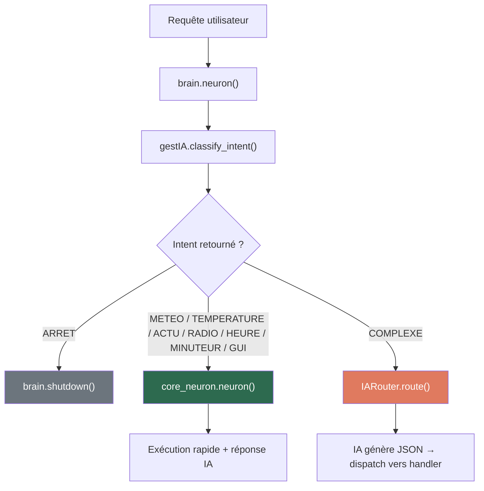
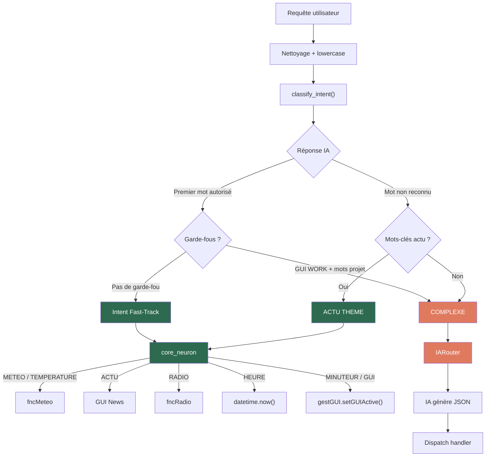

# Garde-fous & Routage vers `core_neuron`

> Documentation du système de classification d'intent et des garde-fous codés en dur qui garantissent que les requêtes arrivent dans `core_neuron` au lieu d'être envoyées au `IARouter`.

---

## Flux global de routage

---

## Niveau 1 : Classification par l'IA (Passe 0)

La méthode [`classify_intent()`](file:///Users/baptistep/Documents/developpement/ArreraNeuronNetwork/gestionnaire/gestIA.py#L206-L323) envoie la requête au modèle IA local avec un prompt qui lui demande de retourner une **pseudo-commande** parmi :

| Pseudo-commande | Format | Exemple |
|---|---|---|
| `METEO` | `METEO [MOMENT] [LIEU]` | `METEO MAINTENANT PARIS` |
| `TEMPERATURE` | `TEMPERATURE [MOMENT] [LIEU]` | `TEMPERATURE DEMAIN DOMICILE` |
| `ACTU` | `ACTU [THEME]` | `ACTU TECH` |
| `RADIO` | `RADIO [NOM/ACTION]` | `RADIO NRJ` |
| `HEURE` | `HEURE` | `HEURE` |
| `MINUTEUR` | `MINUTEUR` | `MINUTEUR` |
| `ARRET` | `ARRET` | `ARRET` |
| `GUI` | `GUI [NOM_GUI]` | `GUI CALCULATRICE` |
| `COMPLEXE` | `COMPLEXE` | `COMPLEXE` |

Si le premier mot de la réponse IA fait partie des mots autorisés → **core_neuron**.  
Sinon → **COMPLEXE** → IARouter.

> [!WARNING]
> Le modèle IA local n'est pas toujours fiable pour cette classification. C'est pourquoi on a ajouté des **garde-fous codés en dur** (Niveau 2).

---

## Niveau 2 : Garde-fous codés en dur

Ces garde-fous interviennent **après** la réponse de l'IA pour corriger ses erreurs de classification. Ils sont dans [`gestIA.py` lignes 278-316](file:///Users/baptistep/Documents/developpement/ArreraNeuronNetwork/gestionnaire/gestIA.py#L278-L316).

---

### Garde-fou 1 : `GUI WORK` → `COMPLEXE`

**Problème résolu** : L'IA confond "ouvre le projet Alpha" avec "ouvre l'interface work".

**Quand** : L'IA a retourné exactement `GUI WORK`.

**Mots-clés détectés dans la requête** :

| Mots-clés | Catégorie |
|---|---|
| `projet`, `project` | Projet |
| `tableur`, `excel` | Tableur |
| `word`, `docx` | Word |
| `ferme`, `crée`, `cree`, `créer`, `creer` | Actions |
| `liste`, `lister`, `fichier` | Navigation |
| `ouvre le projet`, `ferme le projet`, `ouvre un`, `ouvrir le projet`, `ouvrir un` | Phrases complètes |

**Résultat** : Si un de ces mots est trouvé → retourne `COMPLEXE` pour que le `IARouter` traite l'action projet correctement.

**Exemples** :
| Requête | IA dit | Garde-fou | Résultat final |
|---|---|---|---|
| "Ouvre l'interface de travail" | `GUI WORK` | ❌ aucun mot-clé | `GUI WORK` → core_neuron |
| "Ouvre le projet Alpha" | `GUI WORK` | ✅ "projet" détecté | `COMPLEXE` → IARouter |
| "Ferme le tableur" | `GUI WORK` | ✅ "tableur" + "ferme" | `COMPLEXE` → IARouter |
| "Liste mes projets" | `GUI WORK` | ✅ "projet" + "liste" | `COMPLEXE` → IARouter |

---

### Garde-fou 2 : `COMPLEXE` → `ACTU [THEME]`

**Problème résolu** : L'IA ne reconnaît pas les demandes d'actualités et retourne `COMPLEXE`, ce qui fait que l'IARouter répond en texte au lieu d'ouvrir l'interface des actus.

**Quand** : L'IA a retourné un mot-clé non reconnu (donc `COMPLEXE` par défaut).

**Mots-clés d'actualité détectés** :

| Mots-clés |
|---|
| `actualité`, `actualite`, `actualités`, `actualites` |
| `actu`, `actus` |
| `news`, `info`, `infos` |
| `journal`, `nouvelles`, `presse` |
| `quoi de neuf`, `quoi de nouveau` |

**Détection automatique du thème** :

| Mots-clés dans la requête | Thème assigné |
|---|---|
| `tech`, `techno`, `technologie` | `TECH` |
| `science`, `scientifique` | `SCIENCE` |
| `sport`, `sportif`, `sportive` | `SPORT` |
| `culture`, `culturel`, `culturelle` | `CULTURE` |
| `généraliste`, `generaliste`, `général`, `general` | `GENERALISTE` |
| *(aucun thème détecté)* | `TOUT` |

**Résultat** : Retourne `ACTU [THEME]` → core_neuron ouvre la GUI correspondante.

**Exemples** :
| Requête | IA dit | Garde-fou | Résultat final |
|---|---|---|---|
| "Donne-moi les actus" | `COMPLEXE` | ✅ "actus" détecté | `ACTU TOUT` → core_neuron |
| "Les news tech" | `COMPLEXE` | ✅ "news" + "tech" | `ACTU TECH` → core_neuron |
| "Quoi de neuf en sport ?" | `COMPLEXE` | ✅ "quoi de neuf" + "sport" | `ACTU SPORT` → core_neuron |
| "Actualités culturelles" | `COMPLEXE` | ✅ "actualités" + "culturelle" | `ACTU CULTURE` → core_neuron |
| "Calcule 2+2" | `COMPLEXE` | ❌ aucun mot-clé actu | `COMPLEXE` → IARouter |

---

### Garde-fou 3 : Pré-filtre PROJET dans `IARouter`

**Problème résolu** : Le LLM confond `projet_ouvrir` et `projet_lister` — quand on dit "Ouvre le projet Alpha", il retourne l'action de lister au lieu d'ouvrir.

**Où** : Directement dans [`IARouter.route()`](file:///Users/baptistep/Documents/developpement/ArreraNeuronNetwork/neuron/IARouter.py#L142-L199), **avant** d'envoyer la requête au LLM.

**Fonctionnement** : La méthode `__prefilter_projet()` détecte les phrases de projet par mots-clés et dispatch directement vers `__handle_work()` sans passer par le LLM.

**Actions détectées** :

| Action | Mots-clés détectés | Extraction |
|---|---|---|
| `projet_ouvrir` | "ouvre le projet", "ouvrir le projet", "lance le projet", "charge le projet", etc. | Le nom du projet est extrait après le mot-clé |
| `projet_fermer` | "ferme le projet", "quitte le projet", etc. | Aucun paramètre |
| `projet_creer` | "crée un projet", "créer le projet", "nouveau projet", etc. | Le nom du projet est extrait après le mot-clé |
| `projet_lister` | "liste mes projets", "mes projets", "quels sont mes projets", etc. | Aucun paramètre |

**Exemples** :
| Requête | Pré-filtre | Action directe |
|---|---|---|
| "Ouvre le projet assistant" | ✅ `projet_ouvrir` + "assistant" | `__handle_work(["projet_ouvrir", "assistant"])` |
| "Ferme le projet" | ✅ `projet_fermer` | `__handle_work(["projet_fermer"])` |
| "Crée un projet test" | ✅ `projet_creer` + "test" | `__handle_work(["projet_creer", "test"])` |
| "Liste mes projets" | ✅ `projet_lister` | `__handle_work(["projet_lister"])` |
| "Calcule 2+2" | ❌ pas de match | Envoyé au LLM normalement |

---

## Détail des intents gérés par `core_neuron`

Fichier : [`core_neuron.py`](file:///Users/baptistep/Documents/developpement/ArreraNeuronNetwork/neuron/core_neuron.py)

### `METEO [MOMENT] [LIEU]`
- Appelle `fncMeteo` avec le moment et le lieu
- Moments : `MAINTENANT`, `DEMAIN`, `MATIN`, `APREM` (défaut: `MAINTENANT`)
- Lieux : `DOMICILE`/`HOME`, `TRAVAIL`/`WORK`, `LOCATE`, ou nom de ville
- Retourne la ville, description et température via `generate_final_response`
- **valeurOut** : `1`

### `TEMPERATURE [MOMENT] [LIEU]`
- Même logique que METEO mais ne retourne que la température
- **valeurOut** : `1`

### `ACTU [THEME]`
- Ouvre l'interface GUI correspondante au thème

| Thème | GUI cible |
|---|---|
| `TOUT` (ou vide) | `actu_all` |
| `TECH` | `actu_tech` |
| `GENERALISTE` | `actu_main` |
| `SCIENCE` | `actu_science` |
| `SPORT` | `actu_sport` |
| `CULTURE` | `actu_culture` |

- **valeurOut** : `5` (ouverture fenêtre Tkinter)

### `RADIO [NOM/ACTION]`
- `STOP` → arrête la radio
- Noms supportés : `EUROPE 1`, `EUROPE 2`, `FRANCE INFO`, `FRANCE INTER`, `FRANCE MUSIQUE`, `FRANCE CULTURE`, `FRANCE BLEU`, `FUN RADIO`, `NRJ`, `RFM`, `NOSTALGIE`, `SKYROCK`, `RTL`
- **valeurOut** : `22` (radio) ou `1` (stop/erreur)

### `HEURE`
- Retourne l'heure courante formatée en `HH:MM`
- **valeurOut** : `1`

### `MINUTEUR`
- Ouvre l'interface GUI du minuteur
- **valeurOut** : `5`

### `GUI [NOM_GUI]`
- Ouvre l'interface graphique correspondante

| NOM_GUI (intent) | GUI cible |
|---|---|
| `calculatrice` | `calculatrice_normal` |
| `lecture` | `lecture` |
| `orthographe` | `orthographe` |
| `traducteur` | `traducteur` |
| `agenda` | `agenda` |
| `tache` | `tache` |
| `work` | `work` |
| `tache_projet` | `tache_projet` |
| `download` | `arrera_download` |

- **valeurOut** : `5`

### `ARRET`
- Déclenche `brain.shutdown()`
- **valeurOut** : `15`

---

## Schéma complet du routage

