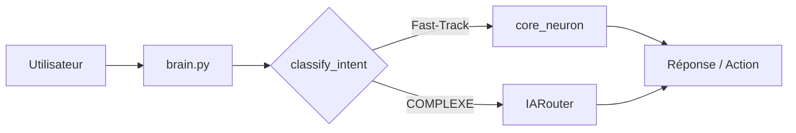

# Référence des fonctions de l'assistant Arrera

> Document exhaustif listant toutes les fonctions que l'assistant est capable d'exécuter, organisées par module et domaine fonctionnel.

---

## Architecture de routage

| Chemin | Quand | Avantage |
|---|---|---|
| **core_neuron** (Fast-Track) | Météo, température, actus, radio, heure, minuteur, GUI, arrêt | Traitement instantané, sans génération JSON |
| **IARouter** (Passe 1 JSON) | Toutes les actions complexes et paramétrées | Parsing fin, extraction des arguments complexes |
| **Garde-fous codés en dur** | Correction proactive si l'IA locale classe mal | Fiabilité absolue |

---

## 1. Météo & Température

> Module : `etatApi` — FNC : `fncMeteo`

| Fonction | Routage | Commande / Action | Exemples de requêtes |
|---|---|---|---|
| Météo actuelle | core_neuron `METEO` / IARouter `meteo` | `meteo actuel [emplacement] [ville]` | "Quel temps fait-il ?", "Météo à Paris", "Quel temps chez moi ?" |
| Météo demain | core_neuron `METEO DEMAIN` | `meteo demain [emplacement] [ville]` | "Quel temps fera-t-il demain ?", "Météo demain à Lyon" |
| Météo du matin | core_neuron `METEO MATIN` | `meteo matin [emplacement] [ville]` | "Météo pour demain matin", "Temps demain matin" |
| Météo de l'après-midi | core_neuron `METEO APREM` | `meteo apres-midi [emplacement] [ville]` | "Météo pour demain après-midi" |
| Température actuelle | core_neuron `TEMPERATURE` | `meteo actuel [emplacement] [ville]` | "Quelle est la température ?", "Combien de degrés dehors ?" |
| Alertes météo | IARouter | `meteo alerte [emplacement]` | "Y a-t-il des alertes météo ?" |

*Emplacements supportés : `home` (domicile), `work` (travail), `locate` (géolocalisation IP/GPS), `custom` (nom de ville).*

---

## 2. GPS & Localisation

> Module : `etatApi` — FNC : `fncGPS`

| Fonction | Routage | Commande / Action | Exemples de requêtes |
|---|---|---|---|
| Localisation actuelle | IARouter | `gps localisation` | "Où suis-je ?", "Donne-moi mes coordonnées GPS", "Ma position" |
| Calcul d'itinéraire | IARouter | `gps itineraire [départ] [arrivée]` | "Itinéraire de Paris à Marseille", "Comment aller à Lyon depuis Lille ?" |
| Département d'une ville | IARouter | `gps departement [ville]` | "Dans quel département se trouve Bordeaux ?" |
| Ville depuis coordonnées | IARouter | `gps ville_coordonnees [lat] [lon]` | "Quelle ville se situe à 48.85, 2.35 ?" |

---

## 3. Actualités & Presse

> Module : `etatApi` — FNC : `fncActualiter`

| Fonction | Routage | Commande / Action | Exemples de requêtes |
|---|---|---|---|
| Toutes les actualités | core_neuron `ACTU TOUT` + Garde-fou 2 | Ouvre GUI `actu_all` | "Donne-moi les actualités", "Quoi de neuf ?", "Les infos du jour" |
| Actualités Tech | core_neuron `ACTU TECH` | Ouvre GUI `actu_tech` | "Donne-moi les actualités tech", "Les news techno" |
| Actualités Généralistes | core_neuron `ACTU GENERALISTE` | Ouvre GUI `actu_main` | "Actualités généralistes", "Le journal du jour" |
| Actualités Sciences | core_neuron `ACTU SCIENCE` | Ouvre GUI `actu_science` | "Quelles sont les news scientifiques ?", "Actus science" |
| Actualités Sport | core_neuron `ACTU SPORT` | Ouvre GUI `actu_sport` | "Les résultats sportifs", "News sport" |
| Actualités Culture | core_neuron `ACTU CULTURE` | Ouvre GUI `actu_culture` | "Actus culturelles", "Nouvelles de la culture" |

*Garde-fou 2 : Si la classification IA échoue mais que des mots-clés d'actu sont présents, l'ouverture de la GUI d'actualités correspondante est automatiquement forcée.*

---

## 4. Radio FM & Web-Radios

> Module : `etatApi` — FNC : `fncRadio`

| Fonction | Routage | Commande / Action | Exemples de requêtes |
|---|---|---|---|
| Lancer une station | core_neuron `RADIO [NOM]` / IARouter | `radio [nom_station]` | "Lance NRJ", "Mets France Info", "Joue Europe 1" |
| Arrêter la radio | core_neuron `RADIO STOP` | `radio stop` | "Arrête la radio", "Coupe la musique", "Stop la radio" |
| État de lecture | IARouter | `radio etat` | "Est-ce que la radio est allumée ?" |
| Liste des stations | IARouter | `open lister_radios` | "Quelles radios sont disponibles ?" |

*Stations préconfigurées : Europe 1, Europe 2, France Info, France Inter, France Musique, France Culture, France Bleu, Fun Radio, NRJ, RFM, Nostalgie, Skyrock, RTL.*

---

## 5. Traduction linguistique

> Module : `etatApi` — FNC : `fncTraduction`

| Fonction | Routage | Commande / Action | Exemples de requêtes |
|---|---|---|---|
| Traduire du texte | IARouter | `traduction [texte] [lang_source] [lang_cible]` | "Traduis 'Bonjour comment allez-vous' en anglais" |
| Ouvrir le traducteur GUI | core_neuron `GUI TRADUCTEUR` + Garde-fou 3 | Ouvre GUI `traducteur` | "Ouvre le traducteur", "Lance l'interface de traduction" |

---

## 6. Briefs & Résumés quotidiens

> Module : `etatApi` — FNC : `fncBrief`

| Fonction | Routage | Commande / Action | Exemples de requêtes |
|---|---|---|---|
| Brief du matin | IARouter | `brief morning` | "Mon brief du matin", "Donne-moi le résumé matinal" |
| Brief de l'après-midi | IARouter | `brief afternoon` | "Brief de l'après-midi" |
| Brief du soir | IARouter | `brief evening` | "Brief du soir", "Récapitulatif de la journée" |

---

## 7. Arrera Work — Tableur

> Module : `etatWork` — FNC : `fncArreraWork`

| Fonction | Routage | Commande / Action | Exemples de requêtes |
|---|---|---|---|
| Ouvrir / Créer un tableur | IARouter | `work tableur_ouvrir` | "Ouvre un tableur", "Crée un tableau Excel" |
| Fermer le tableur actif | IARouter | `work tableur_fermer` | "Ferme le tableur" |
| Lire le contenu | IARouter | `work tableur_lire` | "Lis les données du tableur" |
| Écrire une valeur | IARouter | `work tableur_ecrire [case] [valeur]` | "Écris 150 dans la cellule A1" |
| Supprimer une valeur | IARouter | `work tableur_supprimer [case]` | "Efface la case B4" |
| Appliquer une formule | IARouter | `work tableur_formule [formule] [plage] [cible]` | "Fais la somme de A1 à A10 dans A11" |
| Vérifier l'état | IARouter | `work tableur_etat` | "Un tableur est-il ouvert ?" |
| Ouvrir avec l'application OS | IARouter | `work tableur_ouvrir_os` | "Ouvre le tableur sur mon ordinateur" |

---

## 8. Arrera Work — Traitement de texte (Word)

> Module : `etatWork` — FNC : `fncArreraWork`

| Fonction | Routage | Commande / Action | Exemples de requêtes |
|---|---|---|---|
| Ouvrir / Créer un document | IARouter | `work word_ouvrir` | "Ouvre un document Word", "Nouveau document texte" |
| Fermer le document actif | IARouter | `work word_fermer` | "Ferme le document Word" |
| Lire le texte | IARouter | `work word_lire` | "Lis le document Word ouvert" |
| Écrire / Ajouter du texte | IARouter | `work word_ecrire [texte]` | "Ajoute 'Compte-rendu réunion' dans le document" |
| Écraser tout le texte | IARouter | `work word_ecrire_ecrase [texte]` | "Remplace tout le texte du document par..." |
| Vérifier l'état | IARouter | `work word_etat` | "Y a-t-il un document Word ouvert ?" |
| Ouvrir avec l'application OS | IARouter | `work word_ouvrir_os` | "Ouvre le document Word dans le logiciel du système" |

---

## 9. Arrera Work — Gestion de Projets

> Module : `etatWork` — FNC : `fncArreraWork`

| Fonction | Routage | Commande / Action | Exemples de requêtes |
|---|---|---|---|
| Lister les projets | IARouter + Garde-fou 4 | `work projet_lister` | "Liste mes projets", "Quels sont mes projets Arrera ?" |
| Ouvrir un projet existant | IARouter + Garde-fou 4 | `work projet_ouvrir [nom]` | "Ouvre le projet assistant", "Charge le projet alpha" |
| Créer un nouveau projet | IARouter + Garde-fou 4 | `work projet_creer [nom]` | "Crée un projet nommé WebScraper", "Nouveau projet demo" |
| Fermer le projet actif | IARouter + Garde-fou 4 | `work projet_fermer` | "Ferme le projet", "Quitte le projet actuel" |
| État d'ouverture | IARouter | `work projet_etat` | "Un projet est-il actuellement ouvert ?" |
| Nom du projet en cours | IARouter | `work projet_nom` | "Quel projet est actuellement ouvert ?" |
| Consulter/Définir le type | IARouter | `work projet_get_type` / `projet_type [t]` | "Quel est le type de ce projet ?", "Définit le type en Python" |
| Lister les fichiers du projet | IARouter | `work projet_lister_fichiers` | "Quels sont les fichiers de ce projet ?" |
| Créer un fichier dans le projet | IARouter | `work projet_creer_fichier [nom] [ext]` | "Crée un fichier script avec l'extension py" |
| Ajouter une tâche au projet | IARouter | `work projet_tache_ajouter [nom] [date] [desc]` | "Ajoute la tâche 'Corriger le bug' pour demain au projet" |
| Supprimer une tâche du projet | IARouter | `work projet_tache_supprimer [nom]` | "Supprime la tâche tests du projet" |
| Terminer une tâche du projet | IARouter | `work projet_tache_terminer [nom]` | "Marque la tâche documentation comme terminée" |
| Tâches restantes du projet | IARouter | `work projet_tache_non_terminees` | "Quelles tâches restent à faire dans le projet ?" |
| Tâches du jour du projet | IARouter | `work projet_tache_aujourdhui` | "Quelles sont les tâches du projet pour aujourd'hui ?" |
| Tâches de demain du projet | IARouter | `work projet_tache_demain` | "Quelles sont les tâches du projet pour demain ?" |

*Garde-fou 4 : Pré-filtre par mots-clés dans `IARouter` pour intercepter instantanément "ouvre le projet", "ferme le projet", "crée un projet" et "liste mes projets" sans risque d'hallucination.*

---

## 10. Gestionnaire de Tâches personnelles

> Module : `etatTime` — FNC : `fncArreraTache`

| Fonction | Routage | Commande / Action | Exemples de requêtes |
|---|---|---|---|
| Ajouter une tâche | IARouter | `tache ajouter [nom] [date] [desc]` | "Ajoute une tâche 'Faire les courses' pour demain" |
| Supprimer une tâche | IARouter | `tache supprimer [nom]` | "Supprime la tâche 'Acheter du pain'" |
| Valider / Terminer une tâche | IARouter | `tache terminer [nom]` | "J'ai fini la tâche 'Envoyer email'" |
| Réactiver une tâche | IARouter | `tache reactiver [nom]` | "Réactive la tâche 'Nettoyer le bureau'" |
| Lister toutes les tâches | IARouter | `tache lister_tout` | "Montre-moi toutes mes tâches" |
| Lister tâches non terminées | IARouter | `tache lister_non_terminees` | "Qu'est-ce qu'il me reste à faire ?" |
| Lister tâches terminées | IARouter | `tache lister_terminees` | "Quelles tâches sont déjà terminées ?" |
| Lister tâches d'aujourd'hui | IARouter | `tache lister_aujourdhui` | "Quelles sont mes tâches aujourd'hui ?" |
| Lister tâches de demain | IARouter | `tache lister_demain` | "Quelles sont mes tâches de demain ?" |
| Lister tâches en retard | IARouter | `tache lister_retard` | "Ai-je des tâches en retard ?" |
| Compter les tâches (global) | IARouter | `tache compter` | "Combien ai-je de tâches au total ?" |
| Compter les tâches restantes | IARouter | `tache compter_non_terminees` | "Combien de tâches non terminées ai-je ?" |
| Compter pour aujourd'hui | IARouter | `tache compter_aujourdhui` | "Combien de tâches sont prévues aujourd'hui ?" |
| Compter pour demain | IARouter | `tache compter_demain` | "Combien de tâches demain ?" |
| Compter les retards | IARouter | `tache compter_retard` | "Combien de tâches sont en retard ?" |

---

## 11. Calendrier & Agenda

> Module : `etatTime` — FNC : `fncCalendar`

| Fonction | Routage | Commande / Action | Exemples de requêtes |
|---|---|---|---|
| Ajouter un événement | IARouter | `calendrier ajouter [nom] [date] [heure] [desc] [lieu] [rep]` | "Ajoute un RDV dentiste le 2026-09-01 à 14:30" |
| Supprimer un événement | IARouter | `calendrier supprimer [nom]` | "Supprime le RDV chez le médecin" |
| Lister tous les événements | IARouter | `calendrier lister_tout` | "Montre mon planning complet" |
| Événements du jour | IARouter | `calendrier lister_aujourdhui` | "Qu'ai-je de prévu aujourd'hui dans mon agenda ?" |
| Événements par date | IARouter | `calendrier lister_date [date]` | "Qu'ai-je de prévu le 15 août ?" |
| Détails d'un événement | IARouter | `calendrier details [nom]` | "Donne-moi les détails de l'événement 'Réunion annuelle'" |
| Ouvrir l'agenda GUI | core_neuron `GUI AGENDA` + Garde-fou 3 | Ouvre GUI `agenda` | "Ouvre l'agenda", "Affiche mon calendrier" |

---

## 12. Horloge, Chronomètre & Minuteur

> Module : `etatTime` — FNC : `fncHorloge`

| Fonction | Routage | Commande / Action | Exemples de requêtes |
|---|---|---|---|
| Donner l'heure actuelle | core_neuron `HEURE` | — | "Quelle heure est-il ?", "Donne-moi l'heure" |
| Démarrer le chronomètre | IARouter | `horloge chrono_start` | "Lance le chronomètre", "Démarre le chrono" |
| Arrêter le chronomètre | IARouter | `horloge chrono_stop` | "Arrête le chronomètre", "Stop le chrono" |
| Réinitialiser le chronomètre | IARouter | `horloge chrono_reset` | "Remets le chronomètre à zéro" |
| Temps écoulé au chrono | IARouter | `horloge chrono_temps` | "Quel est le temps du chronomètre ?" |
| Démarrer un minuteur | IARouter | `horloge minuteur_start [durée_sec]` | "Mets un minuteur de 10 minutes", "Minuteur de 30 secondes" |
| Arrêter le minuteur | IARouter | `horloge minuteur_stop` | "Arrête le minuteur" |
| Temps restant minuteur | IARouter | `horloge minuteur_temps` | "Combien de temps reste-t-il au minuteur ?" |
| Ouvrir le minuteur GUI | core_neuron `MINUTEUR` | Ouvre GUI `minuteur` | "Ouvre l'interface du minuteur" |
| Ouvrir le chronomètre GUI | IARouter / core_neuron `GUI CHRONO` | Ouvre GUI `chrono` | "Ouvre l'interface du chronomètre" |
| Ouvrir l'horloge GUI | IARouter / core_neuron `GUI HORLOGE` | Ouvre GUI `horloge` | "Ouvre l'horloge" |

---

## 13. Calculatrice & Mathématiques

> Module : `etatService` — FNC : `fncCalculatrice`

| Fonction | Routage | Commande / Action | Exemples de requêtes |
|---|---|---|---|
| Addition | IARouter | `calculatrice addition [a] [b]` | "Combien font 45 + 132 ?" |
| Soustraction | IARouter | `calculatrice soustraction [a] [b]` | "Calcule 500 moins 128" |
| Multiplication | IARouter | `calculatrice multiplication [a] [b]` | "Combien font 12 fois 15 ?" |
| Division | IARouter | `calculatrice division [a] [b]` | "Divise 250 par 5" |
| Puissance | IARouter | `calculatrice puissance [base] [exp]` | "2 puissance 8" |
| Modulo | IARouter | `calculatrice modulo [a] [b]` | "25 modulo 4" |
| Racine carrée | IARouter | `calculatrice racine [n]` | "Quelle est la racine carrée de 81 ?" |
| Mode complexe | IARouter | `calculatrice complexe` | "Passe la calculatrice en mode complexe" |
| Théorème de Pythagore | IARouter | `calculatrice pythagore [a] [b]` | "Calcule l'hypoténuse pour des côtés de 3 et 4" |
| Réciproque de Pythagore | IARouter | `calculatrice pythagore_reciproque [a] [b] [c]` | "Vérifie si le triangle de côtés 3, 4, 5 est rectangle" |
| Ouvrir Calculatrice standard GUI | core_neuron `GUI CALCULATRICE` + Garde-fou 3 | Ouvre GUI `calculatrice_normal` | "Ouvre la calculatrice", "Lance la calculette" |
| Ouvrir Calculatrice Pythagore GUI | IARouter | Ouvre GUI `calculatrice_pythagore` | "Ouvre la calculatrice en mode Pythagore" |
| Ouvrir Calculatrice Complexe GUI | IARouter | Ouvre GUI `calculatrice_complex` | "Ouvre la calculatrice en mode complexe" |

---

## 14. Synthèse vocale & Orthographe

> Module : `etatService` — FNC : `fncLecture`, `fncOrthographe`

| Fonction | Routage | Commande / Action | Exemples de requêtes |
|---|---|---|---|
| Ouvrir le lecteur de texte GUI | core_neuron `GUI LECTURE` + Garde-fou 3 | Ouvre GUI `lecture` | "Ouvre l'interface de lecture", "Lance le lecteur" |
| Lire un texte à voix haute | IARouter | `lecture lire [texte]` | "Lis ce texte : Bienvenue sur Arrera" |
| Ouvrir le correcteur GUI | core_neuron `GUI ORTHOGRAPHE` + Garde-fou 3 | Ouvre GUI `orthographe` | "Ouvre le correcteur orthographique" |
| Corriger l'orthographe | IARouter | `orthographe corriger [texte]` | "Corrige ce texte : 'Je sui conten detre la'" |

---

## 15. Recherche Web

> Module : `etatSearch` — FNC : `fncArreraSearch`

| Moteur de recherche | Routage | Commande / Action | Exemples de requêtes |
|---|---|---|---|
| Moteur par défaut | IARouter | `recherche recherche [requête]` | "Fais une recherche sur l'intelligence artificielle" |
| Google | IARouter | `recherche google [requête]` | "Cherche sur Google les restaurants à proximité" |
| Brave Search | IARouter | `recherche brave [requête]` | "Recherche sur Brave la documentation Python" |
| DuckDuckGo | IARouter | `recherche duckduckgo [requête]` | "Cherche sur DuckDuckGo comment coder en C" |
| Qwant | IARouter | `recherche qwant [requête]` | "Cherche sur Qwant l'actualité spatiale" |
| Ecosia | IARouter | `recherche ecosia [requête]` | "Recherche sur Ecosia des projets écologiques" |
| Bing | IARouter | `recherche bing [requête]` | "Cherche sur Bing des images de paysages" |
| Perplexity AI | IARouter | `recherche perplexity [requête]` | "Pose la question sur Perplexity" |
| Amazon | IARouter | `recherche amazon [requête]` | "Cherche un clavier mécanique sur Amazon" |
| BigSearch (Multi-moteurs) | IARouter | `recherche big_recherche [requête]` | "Grande recherche sur l'astronomie" |

---

## 16. Lanceur d'applications, Sites & Système

> Module : `etatOpen` — FNC : `fonctionOpen`

| Fonction | Routage | Commande / Action | Exemples de requêtes |
|---|---|---|---|
| Lancer un logiciel configuré | IARouter | `open logiciel [nom]` | "Ouvre Firefox", "Lance VS Code", "Ouvre Discord" |
| Ouvrir un site enregistré | IARouter | `open site_enregistre [nom]` | "Ouvre mon site Github", "Lance Youtube" |
| Ouvrir une URL web | IARouter | `open url [url]` | "Ouvre l'adresse https://news.ycombinator.com" |
| Ouvrir la documentation | IARouter | `open doc_assistant` | "Ouvre la documentation de l'assistant" |
| Lister les logiciels enregistrés | IARouter | `open lister_logiciels` | "Quels logiciels puis-je ouvrir ?", "Liste mes logiciels" |
| Lister les sites enregistrés | IARouter | `open lister_sites` | "Quels sites web ai-je enregistrés ?" |
| Lister les radios | IARouter | `open lister_radios` | "Quelles radios sont configurées ?" |

---

## 17. Téléchargement de vidéos YouTube

> Module : `etatOpen` — FNC : `fncArreraVideoDownload`

| Fonction | Routage | Commande / Action | Exemples de requêtes |
|---|---|---|---|
| Télécharger en format Vidéo | IARouter | `download_youtube 1 [url]` | "Télécharge cette vidéo : [url_youtube]" |
| Télécharger en format Audio (MP3) | IARouter | `download_youtube 2 [url]` | "Télécharge l'audio de cette vidéo : [url_youtube]" |
| Ouvrir l'application Download GUI | core_neuron `GUI DOWNLOAD` + Garde-fou 3 | Ouvre GUI `arrera_download` | "Ouvre Arrera Download", "Ouvre le téléchargeur" |

---

## 18. Assistance au Développement (CodeHelp)

> Module : `etatCodehelp` — FNC : `fncCodehelp`

| Fonction | Routage | Commande / Action | Exemples de requêtes |
|---|---|---|---|
| Rechercher sur DevDocs | IARouter | `codehelp doc_devdoc [requête]` | "Cherche Array.prototype.map sur DevDocs" |
| Rechercher sur Microsoft Learn | IARouter | `codehelp doc_microsoft [requête]` | "Cherche ASP.NET Core sur Microsoft Learn" |
| Rechercher dans la Doc Python | IARouter | `codehelp doc_python [requête]` | "Cherche la fonction asyncio.gather dans la doc Python" |
| Rechercher sur GitHub | IARouter | `codehelp github_search [requête]` | "Cherche des dépôts de vision par ordinateur sur GitHub" |
| Ouvrir le site GitHub | IARouter | `codehelp github_site` | "Ouvre GitHub" |
| Sélecteur de couleurs GUI | IARouter | Ouvre GUI `gui_color` | "Ouvre le sélecteur de couleurs" |
| Gestionnaire GitHub GUI | IARouter | Ouvre GUI `gui_github` | "Ouvre le gestionnaire GitHub" |
| Gestionnaire de librairies GUI | IARouter | Ouvre GUI `gui_librairy` | "Ouvre le gestionnaire de librairies" |
| Organisateur de variables GUI | IARouter | Ouvre GUI `gui_orgavar` | "Ouvre l'organisateur de variables" |

---

## 19. Interfaces Graphiques Globales (GUIs)

> Routage : `core_neuron.py` (Fast-track) + Garde-fou 3 (`gestIA.py`)

L'utilisateur peut ouvrir n'importe quelle interface avec les verbes : *ouvre, ouvrir, montre, montrer, affiche, afficher, lance, lancer, démarre, active*.

| Nom de l'Interface | Identifiant GUI | Exemples d'invocations naturelles |
|---|---|---|
| Calculatrice | `CALCULATRICE` | "Ouvre la calculatrice", "Montre la calculette" |
| Lecteur de texte | `LECTURE` | "Ouvre le lecteur de texte", "Lance la lecture" |
| Correcteur orthographique | `ORTHOGRAPHE` | "Ouvre le correcteur d'orthographe" |
| Traducteur | `TRADUCTEUR` | "Ouvre le traducteur", "Affiche la traduction" |
| Agenda & Calendrier | `AGENDA` | "Ouvre mon agenda", "Affiche le calendrier" |
| Gestionnaire de Tâches | `TACHE` | "Ouvre mes tâches", "Affiche la to-do list" |
| Arrera Work (Accueil) | `WORK` | "Ouvre Arrera Work", "Ouvre l'espace de travail" |
| Tâches du Projet | `TACHE_PROJET` | "Ouvre les tâches du projet" |
| Arrera Download | `DOWNLOAD` | "Ouvre Arrera Download", "Ouvre le téléchargeur" |

---

## 20. Système & Mode Conversationnel

| Fonction | Routage | Déclenchement | Description |
|---|---|---|---|
| Arrêt de l'assistant | core_neuron `ARRET` | "Arrête-toi", "Au revoir", "Bonne nuit", "Éteins-toi", "Stop" | Déclenche la procédure de fermeture propre (`brain.shutdown()`). |
| Discussion libre / IA | IARouter `reponse_simple` | Toute question générale, culturelle ou créative | Réponse textuelle et vocale générée par le modèle de langage local. |

---

## Synthèse globale par module

| Module (`confNeuron`) | Nombre d'actions | Domaines fonctionnels |
|---|:---:|---|
| `etatApi` | 20 | Météo, Coordonnées GPS, Itinéraires, Actualités, Radios FM, Traduction, Briefs temporels |
| `etatWork` | 34 | Tableur Excel, Traitement de texte Word, Gestion de projets, Fichiers & Tâches de projet |
| `etatTime` | 28 | Gestionnaire de tâches personnelles, Agenda/Calendrier, Horloge, Chronomètre, Minuteur |
| `etatService` | 16 | Calculatrice basique & avancée (Pythagore, Complexes), Lecteur TTS, Correcteur d'orthographe |
| `etatSearch` | 10 | Recherche web (10 moteurs dont Google, DuckDuckGo, Brave, Perplexity, BigSearch) |
| `etatOpen` | 10 | Lanceur de logiciels système, Raccourcis web, Téléchargement vidéo/audio YouTube, Doc |
| `etatCodehelp` | 9 | Recherches DevDocs, Microsoft, Python, GitHub, Sélecteur de couleurs, Outils dev GUI |
| Système & IA | 2 | Extinction/Arrêt de l'assistant, Discussion libre conversationnelle |
| **TOTAL GÉNÉRAL** | **~129 actions** | **Couverture complète de l'écosystème Arrera** |
